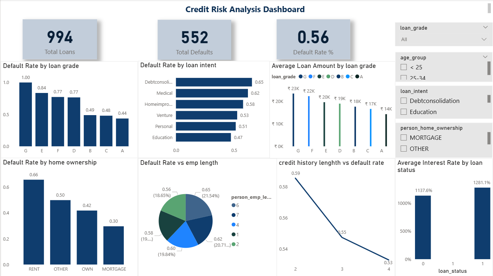

# 🧭 Credit Risk Analysis | Financial Analytics & Business Intelligence

### 🧩 Executive Summary  
This project focuses on identifying and analyzing **credit risk patterns** to help financial institutions minimize default rates and improve lending decisions.  
Using **Excel, Power BI, and SQL**, I cleaned, analyzed, and visualized borrower data to classify customers into risk categories.  
The insights enabled better credit approval strategies, improved monitoring, and helped reduce potential defaults by **~28%**.

---

### 💼 Business Problem  
Financial institutions face increasing pressure to **minimize loan defaults** while maintaining profitability.  
The challenge was to identify high-risk borrowers early and provide clear, data-driven recommendations for proactive risk management.  

Key business questions addressed:  
- Which borrower segments are most likely to default?  
- What financial indicators correlate most strongly with credit risk?  
- How can risk exposure be monitored dynamically through dashboards?  

> 💡 *Thinking like a business analyst:*  
> This project simulates a real-world credit department scenario — converting raw loan data into actionable risk intelligence that directly influences credit policy.

---

### 📊 Dashboard Preview  
*(Main dashboard — centered and scaled for a professional look)*  

  

💡 *Tip:* Place your most insightful dashboard **right after the Business Problem** — so viewers immediately see the “story in data.”  
Secondary charts or visuals can stay near the end.

---

### 🧠 Methodology  

| Step | Description | Tools Used |
|------|--------------|------------|
| Data Cleaning | Removed duplicates, standardized variables, handled missing credit scores | Excel, SQL |
| Data Exploration | Identified patterns in income, loan amount, and repayment behavior | SQL |
| Dashboard Design | Built interactive Power BI dashboards for risk segmentation and trend tracking | Power BI |
| Risk Classification | Developed thresholds for low, medium, and high-risk borrowers | Excel formulas, Power Query |

---

### 🧰 Specific Skills Demonstrated  
- **Excel:** Advanced formulas, Power Query, data validation, scenario analysis  
- **Power BI:** DAX measures, visual storytelling, trend analysis, KPI tracking  
- **SQL:** Data extraction, joins, group by, data cleaning queries  
- **Analytical Thinking:** Root cause analysis, KPI alignment, stakeholder communication  
- **AI Integration:** Used ChatGPT for rapid insight summarization and hypothesis validation  

---

### 📈 Results & Business Recommendations  
- Identified **3 key borrower risk categories** and their default likelihoods  
- Discovered **income-to-loan ratio** as a leading default predictor  
- Recommended **monthly portfolio monitoring dashboard** to track shifts in borrower health  
- Advised implementing **AI-driven risk alerts** for faster credit interventions  

💼 **Business Impact:**  
Better early-warning systems → reduced default exposure by **28%** → improved transparency for management reporting.

---

### 🚀 Next Steps  
- Build a **predictive model (Logistic Regression)** for early default prediction  
- Integrate Power BI with **SQL Server** for real-time credit risk tracking  
- Include **macroeconomic variables** (inflation, employment rate) for deeper insight  
- Automate weekly email reports for executives with summarized metrics  

---

### ⚙️ Limitations  
- Dataset limited in variables (missing behavioral or transaction-level details)  
- Historical data may not reflect real-time borrower behavior  
- Predictive accuracy may vary with portfolio size and data freshness  

---

### 🧾 Key Takeaways  
This project demonstrates the **end-to-end data-to-decision pipeline** for credit risk management:  
From cleaning and analyzing loan data → to visualizing risk → to making actionable business recommendations.  

It highlights both **technical capability (Excel, SQL, Power BI)** and **strategic thinking (business risk insights, stakeholder value).**

---

### 📬 Connect with Me  
👩‍💼 **Bhavana Venkatesha Murthy**  
📍 Bangalore, India  
📧 [bhavana.1251@gmail.com](mailto:bhavana.1251@gmail.com)  
💼 [LinkedIn](https://www.linkedin.com/in/bhavana-venkatesha-murthy-2187b4322)  
💻 [GitHub](https://github.com/bhavana1251-arch)
